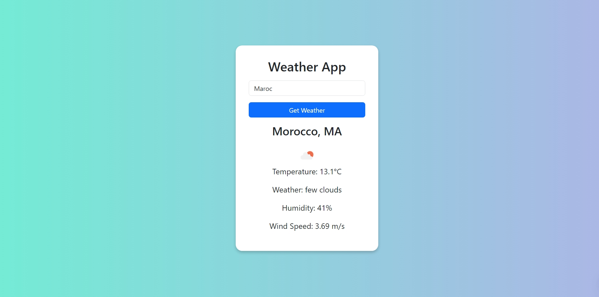
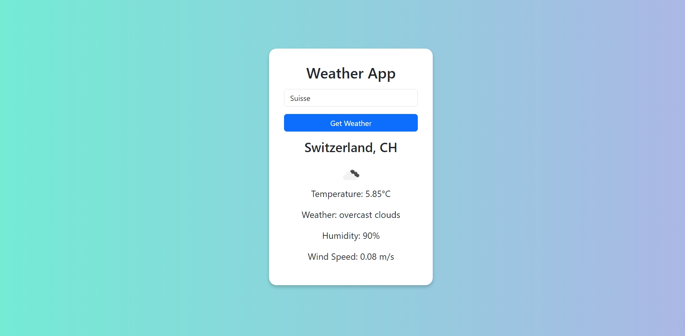
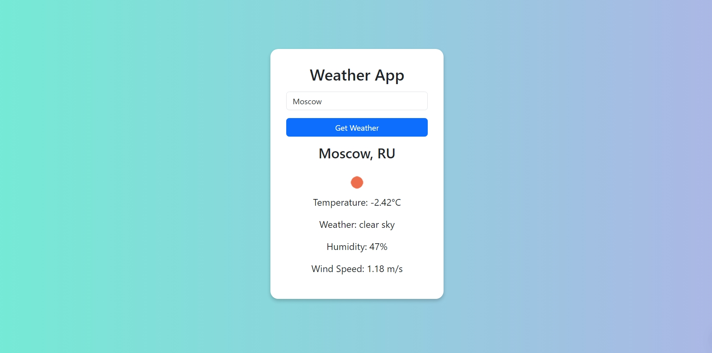

Weather App
A simple weather application built using HTML, CSS, and JavaScript that allows users to check the current weather of any city. The app fetches real-time data from the OpenWeather API and displays the weather details, including temperature, humidity, wind speed, and weather description along with an icon representing the current weather condition.

Features
Enter the name of a city to get real-time weather information.
Displays the temperature, weather description, humidity, and wind speed.
Weather icons are displayed based on the current weather condition.
Responsive design using Bootstrap for mobile and desktop support.
Error handling in case of invalid city names or API issues.

Technologies Used
HTML5: Markup structure of the app.
CSS3: Styling of the app using modern CSS techniques.
JavaScript: Fetching data from the OpenWeather API and handling dynamic content.
OpenWeather API: API for fetching weather data.
Bootstrap 5: For responsive design and components.

API Key
This app uses the OpenWeather API to fetch weather data. To use it, you'll need your own API key:

Go to OpenWeather API.
Sign up and get your API key.
Replace the API_KEY variable in the script.js file with your own key.

const API_KEY = 'your-api-key-here';
Installation
To run this project locally:

Clone this repository:

git clone https://github.com/yourusername/weather-app.git
Navigate to the project folder:

cd weather-app
Open index.html in your browser to view the app.

How to Use
Open the app in your browser.
Enter the name of the city in the input field.
Click the "Get Weather" button to fetch and display the weather information for that city.
If an invalid city name is entered, an error message will be displayed.
Screenshots
Main UI:

Example:
Enter a valid city name like "London":
Shows temperature, weather description, humidity, wind speed, and an icon.
License
This project is open-source and available under the MIT License.
